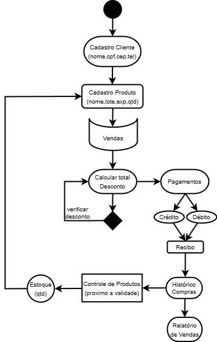

<h2><a href= "https://www.mackenzie.br">Universidade Presbiteriana Mackenzie</a></h2>
<h3><a href= "https://www.mackenzie.br/graduacao/sao-paulo-higienopolis/sistemas-de-informacao">Sistemas de Informação</a></h3>

<h3>Sistema de Gestão para a Farmácia Vida Saudável</h3>

**Conteúdo**

- [Autores](#nome-alunos)
- [Descrição do Projeto](#introdução-do-projeto)
- [Análise de Requisitos Funcionais e Não-Fucionais](#descrição-dos-requisitos)
- [Diagrama de Atividades](#diagrama-de-atividades) 
- [Diagrama de Casos de Uso](#diagrama-de-comportamento-atores)
- [Descrição dos Casos de Uso](#descrição-das-funcões)
- [Diagrama de Senquencia](#diagrama-de-ordem-interações)
- [Diagrama de Classes](#diagrama-orientado-objetos)
- [Diagrama de Estados](#diagrama-estrutura-componente)
- [Diagrama de Implantação](#diagrama-de-hardware-software)
- [Referências](#referências)

# Autores

* <b>Andre Drumond - 10724048</b>
* <b>Eduardo Rodrigues - 10727042</b>
* <b>Gabriel Henrique - 10439251</b>
* <b>Isaac Koga - 10723323</b>

# Descrição do Projeto

O Sr. Boticário contratou a nossa empresa de desenvolvimento - MACK
Solutions SW - para criar um sistema que otimize a operação da farmácia.
Ele espera um sistema simples e eficiente que facilite as operações
diárias dos funcionários, garantindo maior precisão e rapidez no
atendimento.

# Análise de Requisitos Funcionais e Não-Funcionais
*&lt;Descrição dos requisitos&gt;*

# Diagrama de Atividades

# Diagrama de Casos de Uso

*&lt;Diagrama para visualizar o comportamento dos atores&gt;*

# Descrição dos Casos de Uso

*&lt;Descrição do comportamento entre os atores/resquisitos&gt;*

# Diagrama de Sequência

*&lt;Diagrama de ordem e interação dos objetos&gt;*

# Diagrama de Classes

*&lt;Diagrama de relacionamento entre classes para os seus atributos e operações&gt;*

# Diagrama de Estados

*&lt;Diagrama para permite modelar o comportamento interno de um determinado objeto, subsistema ou sistema global&gt;*

# Diagrama de Implantação

*&lt;Diagrama para exibir o relacionamento de hardware e software no projeto&gt;*

# Referências

*&lt;Lista de referências&gt;*
