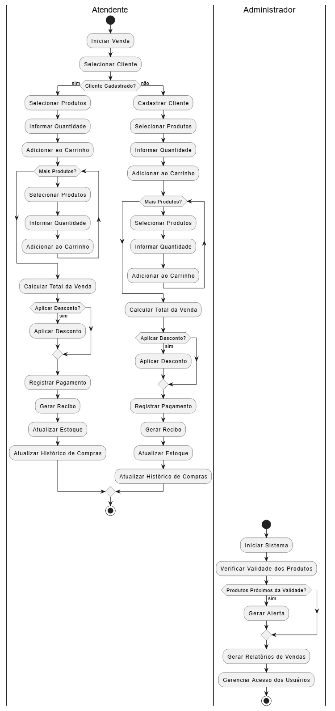
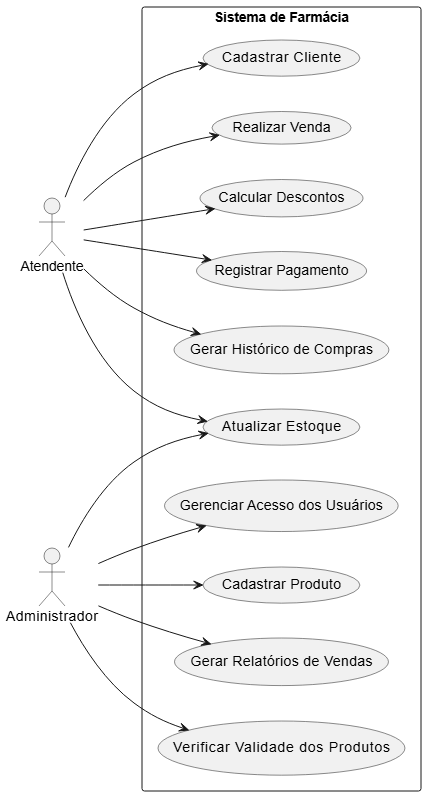

<h2><a href= "https://www.mackenzie.br">Universidade Presbiteriana Mackenzie</a></h2>
<h3><a href= "https://www.mackenzie.br/graduacao/sao-paulo-higienopolis/sistemas-de-informacao">Sistemas de Informação</a></h3>

<h3>Sistema de Gestão para a Farmácia Vida Saudável</h3>

**Conteúdo**

- [Autores](#nome-alunos)
- [Descrição do Projeto](#introdução-do-projeto)
- [Análise de Requisitos Funcionais e Não-Fucionais](#descrição-dos-requisitos)
- [Diagrama de Atividades](#diagrama-de-atividades) 
- [Diagrama de Casos de Uso](#diagrama-de-comportamento-atores)
- [Descrição dos Casos de Uso](#descrição-das-funcões)
- [Diagrama de Senquencia](#diagrama-de-ordem-interações)
- [Diagrama de Classes](#diagrama-orientado-objetos)
- [Diagrama de Estados](#diagrama-estrutura-componente)
- [Diagrama de Implantação](#diagrama-de-hardware-software)
- [Referências](#referências)

# Autores

* <b>Andre Drumond - 10724048</b>
* <b>Eduardo Rodrigues - 10727042</b>
* <b>Gabriel Henrique - 10439251</b>
* <b>Isaac Koga - 10723323</b>

# Descrição do Projeto

O projeto visa desenvolver um sistema informatizado para a Farmácia Vida Saudável, otimizando vendas, controle de estoque e cadastro de clientes, substituindo o processo manual que causa erros e dificuldades na gestão financeira. 

O sistema permitirá o registro de medicamentos, clientes e vendas, atualizando automaticamente o estoque e gerando relatórios gerenciais. Além disso, contará com controle de acesso para atendentes e administradores. Seguindo diretrizes de modelagem UML, o desenvolvimento incluirá análise de requisitos e diagramas estruturais, garantindo maior precisão, rapidez e eficiência nas operações da farmácia.

# Análise de Requisitos Funcionais e Não-Funcionais
<h3>Requisitos Funcionais (RF)</h3>

<h4>São os requisitos que definem as funcionalidades e comportamentos esperados do sistema:</h4>

<b>RF01 | Cadastro de Clientes:</b> O sistema deve permitir o cadastro de clientes com as seguintes informações: nome completo, CPF, CEP e telefone. Esses dados serão utilizados para histórico de compras e geração de relatórios. 

<b>RF02 | Cadastro de Produtos (Medicamentos):</b> O sistema deve permitir o registro de produtos, contendo nome, lote, data de validade, quantidade em estoque e fabricante. Também deve ser possível informar o preço de venda de cada item. 

<b>RF03 | Realização de Vendas:</b> O sistema deve permitir que um atendente registre uma venda, vinculando os produtos comprados a um cliente previamente cadastrado. 

<b>RF04 | Cálculo de Descontos:</b> Durante a venda, o sistema deve calcular o valor total da compra e aplicar descontos, caso estejam disponíveis ou previstos por regras do sistema (ex: promoções, quantidade, validade próxima, etc.). 

<b>RF05 | Pagamento:</b> O sistema deve registrar o pagamento da compra, aceitando métodos como crédito e débito, e gerar um recibo após a finalização. 

<b>RF06 | Atualização de Estoque:</b> O sistema deve atualizar automaticamente o estoque com base nas quantidades vendidas, garantindo que os dados estejam sempre sincronizados. 

<b>RF07 | Controle de Produtos Próximos da Validade:</b> O sistema deve verificar periodicamente a validade dos produtos e alertar o administrador caso estejam próximos do vencimento. 

<b>RF08 | Histórico de Compras:</b> Cada cliente deve ter um histórico de compras atualizado automaticamente após cada venda, com data, produtos comprados e valor total. 

<b>RF09 | Relatórios de Vendas:</b> O sistema deve gerar relatórios de vendas diárias, semanais e mensais, incluindo informações como produtos mais vendidos e clientes mais frequentes. 

<b>RF10 | Controle de Acesso por Perfil de Usuário:</b> O sistema deve permitir autenticação de usuários com perfis distintos: Atendentes: podem consultar produtos, realizar vendas e acessar o estoque. Administradores: podem cadastrar produtos, gerar relatórios, visualizar histórico e controlar acesso. 

 
<h3>Requisitos Não-Funcionais (RNF)</h3> 

<h4>Estes requisitos definem restrições, qualidades e condições do sistema:</h4> 

<b>RNF01 | Usabilidade:</b> O sistema deve possuir uma interface amigável e intuitiva, que facilite o uso por funcionários com diferentes níveis de conhecimento técnico. 

<b>RNF02 | Desempenho:</b> As operações do sistema, como consulta de estoque e finalização de venda, devem ser realizadas em até 2 segundos, garantindo fluidez no atendimento. 

<b>RNF03 | Segurança:</b> Deve haver autenticação de usuários, proteção dos dados pessoais dos clientes e registros das ações feitas no sistema. 

<b>RNF04 | Escalabilidade:</b> O sistema deve estar preparado para crescer em volume de usuários, produtos e vendas, sem perda significativa de desempenho. 

<b>RNF05 | Confiabilidade:</b> O sistema deve garantir a integridade dos dados armazenados, evitando perdas ou duplicações em casos de falhas ou reinicializações. 

<b>RNF06 | Compatibilidade:</b> O sistema deve funcionar em diferentes navegadores modernos e ser compatível com dispositivos desktop e tablets utilizados na farmácia.

 

# Diagrama de Atividades

# Diagrama de Casos de Uso

# Descrição dos Casos de Uso
## 1. Cadastrar Cliente (UC1)

**Descrição:** Permite que o atendente registre novos clientes no sistema.

**Fluxo:**

1.  O atendente insere os dados do cliente (nome completo, CPF, CEP, telefone).
2.  O sistema valida os dados.
3.  O sistema armazena os dados do cliente no banco de dados.
4.  O sistema confirma o cadastro do cliente.

**Ator:** Atendente.

## 2. Cadastrar Produto (UC2)

**Descrição:** Permite que o administrador registre novos produtos (medicamentos) no sistema.

**Fluxo:**

1.  O administrador insere os dados do produto (nome, lote, data de validade, quantidade em estoque, fabricante, preço de venda).
2.  O sistema valida os dados.
3.  O sistema armazena os dados do produto no banco de dados.
4.  O sistema confirma o cadastro do produto.

**Ator:** Administrador.

## 3. Realizar Venda (UC3)

**Descrição:** Permite que o atendente registre uma venda de produtos para um cliente.

**Fluxo:**

1.  O atendente seleciona o cliente (cadastrado ou novo).
2.  O atendente seleciona os produtos e suas quantidades.
3.  O sistema adiciona os produtos ao carrinho de compras.
4.  O sistema calcula o total da venda.

**Ator:** Atendente.

## 4. Calcular Descontos (UC4)

**Descrição:** Permite que o sistema calcule e aplique descontos durante a venda.

**Fluxo:**

1.  O sistema verifica se há descontos aplicáveis (promoções, quantidade, validade próxima).
2.  O sistema calcula o valor do desconto.
3.  O sistema aplica o desconto ao total da venda.

**Ator:** Atendente.

## 5. Registrar Pagamento (UC5)

**Descrição:** Permite que o atendente registre o pagamento da venda.

**Fluxo:**

1.  O atendente seleciona o método de pagamento (crédito, débito).
2.  O atendente insere os dados do pagamento.
3.  O sistema processa o pagamento.
4.  O sistema gera um recibo.

**Ator:** Atendente.

## 6. Atualizar Estoque (UC6)

**Descrição:** Permite que o sistema atualize o estoque com base nas vendas.

**Fluxo:**

1.  O sistema subtrai as quantidades vendidas do estoque.
2.  O sistema atualiza os dados do estoque no banco de dados.

**Atores:** Atendente, Administrador.

## 7. Verificar Validade dos Produtos (UC7)

**Descrição:** Permite que o sistema verifique a validade dos produtos e gere alertas.

**Fluxo:**

1.  O sistema verifica periodicamente a validade dos produtos.
2.  O sistema gera alertas para produtos próximos da validade.

**Ator:** Administrador.

## 8. Gerar Histórico de Compras (UC8)

**Descrição:** Permite que o sistema gere o histórico de compras dos clientes.

**Fluxo:**

1.  O sistema registra as vendas no histórico de compras do cliente.
2.  O sistema exibe o histórico de compras do cliente.

**Ator:** Atendente.

## 9. Gerar Relatórios de Vendas (UC9)

**Descrição:** Permite que o sistema gere relatórios de vendas.

**Fluxo:**

1.  O administrador seleciona o período do relatório (diário, semanal, mensal).
2.  O sistema gera o relatório com informações como produtos mais vendidos e clientes mais frequentes.
3.  O sistema exibe o relatório.

**Ator:** Administrador.

## 10. Gerenciar Acesso dos Usuários (UC10)

**Descrição:** Permite que o administrador gerencie o acesso dos usuários ao sistema.

**Fluxo:**

1.  O administrador cadastra, edita ou exclui usuários.
2.  O administrador define os perfis de acesso dos usuários.

**Ator:** Administrador.

# Diagrama de Sequência

*&lt;Diagrama de ordem e interação dos objetos&gt;*

# Diagrama de Classes

*&lt;Diagrama de relacionamento entre classes para os seus atributos e operações&gt;*

# Diagrama de Estados

*&lt;Diagrama para permite modelar o comportamento interno de um determinado objeto, subsistema ou sistema global&gt;*

# Diagrama de Implantação

*&lt;Diagrama para exibir o relacionamento de hardware e software no projeto&gt;*

# Referências

*&lt;Lista de referências&gt;*
